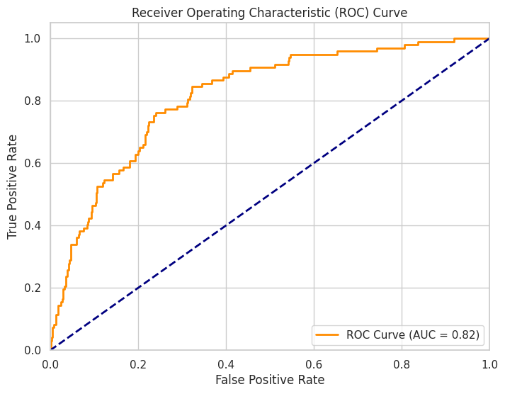
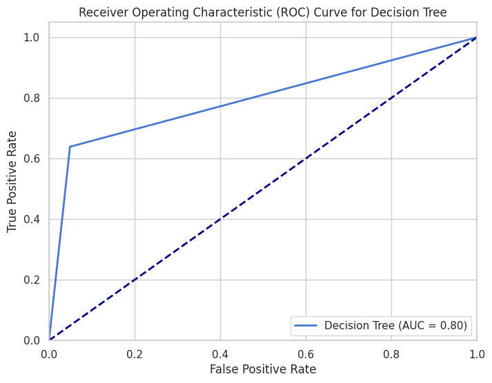
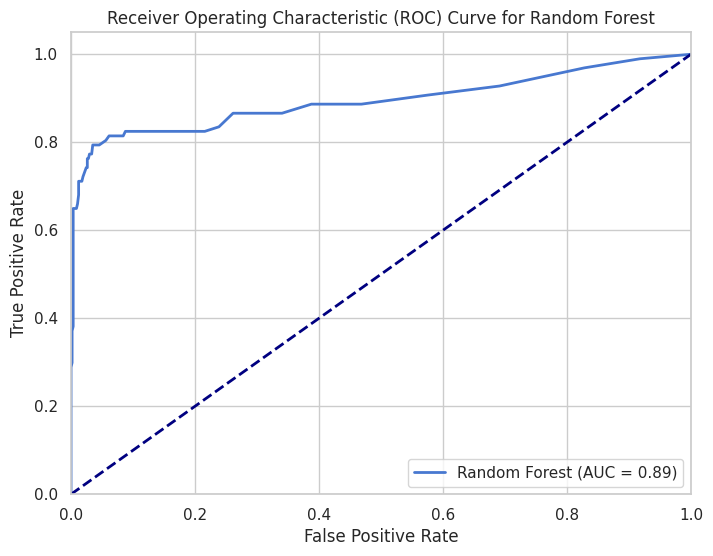

# Introduction
The urge to grow and expand with the business is still among the key concerns that guide the decisions and policies in organizations. While any successful business person would like to see an increase in their revenues, customers and level of profitability, they must at all times, endeavor to limit losses as much as possible. In the recent past, leaders, and also business personalities have noted customer satisfaction as a key determinant of such growth and development. Customers are central to every business as they are the potential buyers of business products or services, sources of revenue, and the reason for making profits. This goes a long way in pointing out the need for firms to undertake strategies that see customer retention in place. A relatively newer development is that technological factors have also led to greater business rivalry especially because of the presence of more startups and entrants. Such competition together with an increase in the degree of market saturation implies that it has become increasingly difficult and costly to attract new customers across most industries, which in turn implies that firms must invest in retaining the current clientele. In The Value of Keeping the Right Customers, an article written by Amy Gallo, published 19th February, 2014 the author is so profound in stating that any business should always spend more trying to retain its clientele base than attempting to get new customers. Gallo submits that the expense of getting a new client is between five and twenty-five times more than to retain a current customer and that an increase of 5 percent in customer retention leads to profit increase of between 25 percent to 95 percent. In this context, this project is aimed at creating a prediction model, which can show the patterns concerning customer churning so that action could be taken to prevent this process. In this report we will be using Syriatel Mobile Telecom as our case study

# Discussions
## Logistic Regression
Logistic regression is perhaps one of the most basic methods for binary classification, but serves as a good starting point. In general, it proposes an affine function, where the value of the features is proportional to the log-odds of the target. This model offer an overview of the data and is often used as reference for more complicated models (Schober, 2021). The regularization and solver technique methods used are the following ones; Only default parameters for these techniques have been used in this case. Since the model is comparatively simple, no extensive tuning of the hyperparameters was carried out other than the general reuse of L2 regularization.

## Decision Trees
Decision trees are convenient to use for the fact that they consider non-linear relationships between input variables and the output variable (Lin, 2020, November). They also are easy to understand and which offers a graphical representation of the decision process. The model was exempted to form the maximum depth to avoid cases of overfitting. Other parameters; such as, minimum samples nodes per leaf, was adjusted based on the need to reduce a lot of detail into the model, while maintaining accuracy.

## Support Vector Machine (SVM)
SVM is best used in high dimension space and is suitable where the classes are not linearly separable through the use of kernel trick (Kurani, 2023). It was chosen to find out how it would analyze the rich and extensive associations in our data. To handle complications involving non-linear systems we adopted the use of a Radial basis function (RBF) Kernel. The cost parameter (C) was then adjusted in order to set the margin and avoid problems of overfitting.

## Random Forest
Random Forest is another supervised learning method that works as follows; It constructs a multitude of decision trees and then makes the final prediction by averaging the respective outcome of all the trees. It avoids the problem of over fitting in a model and enhances the concept of generalization by taking the average of the tree’s prediction (Genuer, 2020). To control model complexity we used 100 trees with the maximum depth parameter. Random forests are very stable models and generally do not need much hyperparameter tuning.

## K-Nearest Neighbors (KNN)
KNN is the simplest form of learning algorithms which falls under the classification of instance-based learning. In this it makes prediction with reference to the majority of the classes of the k nearest points in the feature space (Uddin, 2022). This model was chosen for comparison because it categorizes objects in a different way than the discussed model. The parameter k which represents the number of neighbors was fixed at 5. An increase in ‘k’ regularizes the decision boundary but it may lead to lower sensitivity to features within the data points. Each model above was assessed in terms of its accuracy, precision, recall, and F1-score and cross-validation was done in order to check for the model’s solidity. The use of all these methods enables one to compare the performance of linear models, non-linear models, and ensemble approaches giving a rich analysis of the models.

# Model Selection
Among the algorithms, Random Forest achieved the maximum test accuracy equal to 0. 94 along with precision of 0. 91, recall of 0. 69, and F1-score of 0. 78. This model demonstrates strong predictive capabilities and effectively balances the trade-offs between precision and recall, making it the most suitable for predicting customer churn. Logistic regression, while providing a simple baseline, performed poorly in terms of recall, suggesting it is not capturing the complex patterns in the data. Based on these findings, the Random Forest model is suggested for deployment as it is the final model and undergoes rigidity and generalizability tests.

